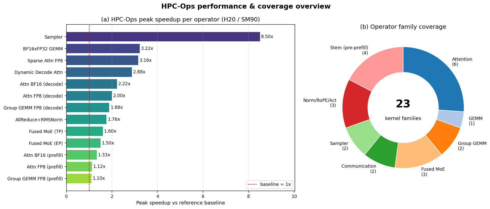
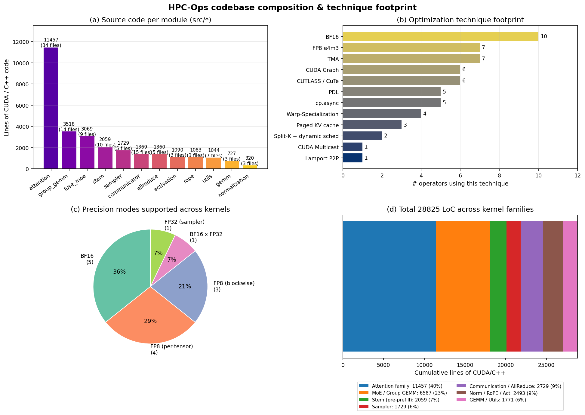
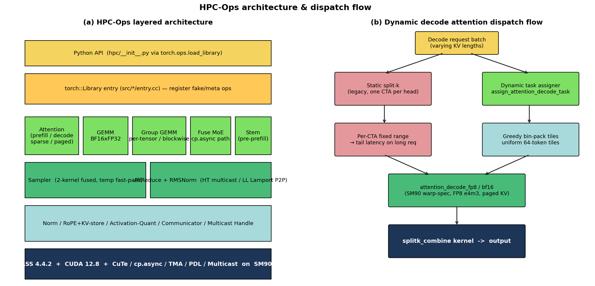
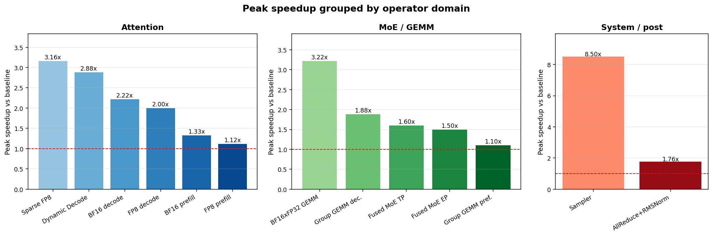

# HPC-Ops 工程分析报告

> 分析日期：2026-06-12  
> 仓库：`https://github.com/XFDG/hpc-ops`（fork 自 `Tencent/hpc-ops`）  
> 当前 HEAD：`0da60f4` Update README and project logo (#55)  
> 分析分支：`analysis/code-walkthrough`  
> 路径：`/volume/yzhao04/workspace/hpc-ops`

## 一、项目背景（Background）

HPC-Ops 是 **腾讯混元 AI Infra 团队** 开源的 LLM 推理算子库，
定位是「production-grade、面向 NVIDIA H20 / SM90 GPU 的高性能算子集合」。
目标是在大模型在线推理（prefill / decode）中替换或补强 vLLM、SGLang、FlashInfer、cuBLAS、TensorRT-LLM、NCCL
等开源算子的热点路径。

工程主要解决三个层面的问题：

1. **推理热点路径性能不足**：Attention、MoE、GEMM、Sampler、AllReduce+RMSNorm
   是在线推理的真实瓶颈，开源框架的对应实现往往在某些 shape 或精度组合下不足以满足 SLA。
2. **变长 / 稀疏 / 低精度场景缺少高效内核**：长上下文 prefill、低延迟 decode、
   FP8 块稀疏、blockwise FP8 MoE、TP/EP 通信-计算融合等场景需要针对硬件做深度优化。
3. **可作为 SM90 现代 CUDA 教程**：把 CUTLASS 4.4.2 / CuTe / cp.async / TMA / PDL / Multicast
   等技术放在「可读、可编译、可对比」的工程里。

### 1.1 整体性能与算子覆盖

下面是 README 中 Performance 表的整理。左图为「单算子峰值加速比」，
右图为「按算子家族分组的内核数量」。可以看到 Sampler 在 vocab=120832 的小 batch 场景能拿到 **8.5x**，
GEMM / 稀疏 attention / 动态 decode 在 2.5x–3.2x 区间，
其余算子主要落在 1.1x–2.2x 区间，整体覆盖 23 个核家族。

## 二、开发环境（Environment）

### 2.1 硬件 / 软件栈

- **目标 GPU**：NVIDIA H20 / SM90（CMakeLists 强制 `CUDA_ARCHITECTURES=90a`）。
- **CUDA Toolkit**：12.8+（README 明确要求）。
- **第三方依赖**：CUTLASS 4.4.2（位于 `3rd/cutlass`）、PyTorch（用其
  `torch::Library` 注册算子，并复用 cuda runtime 头）。
- **构建系统**：`setup.py` → `CMakeBuild` → 调用 `cmake --build` 多线程编译，
  产物落到 `hpc/_C.abi3.so`（Python Limited API `cp39`）。
- **Python**：3.8+；测试依赖在 `requirements-dev.txt`。

### 2.2 仓库结构与代码量

工程 13 个 src 模块，CUDA/C++ 代码合计 **28825 行**。Attention 家族占 40%
（`src/attention/`，11457 行），MoE / Group-GEMM 占 23%，下面的图比较了模块体量、
所用优化技术、精度模式和总体占比：

读图重点：

- **(a) 模块代码量**：Attention 是绝对大头（11k 行），其内部还分 prefill / decode 两套，
  prefill 又分 multi-stage / warp-spec / blocksparse-fp8 等多份模板。
- **(b) 技术分布**：BF16 是十个算子的「兜底精度」；FP8 e4m3 出现在 7 个算子里；
  TMA、cp.async、PDL、CUDA Graph 是几乎所有 SM90 内核的标配。
- **(c) 精度模式**：FP8 per-tensor / blockwise 合计 50%，BF16 占 36%，
  其余包括 BF16xFP32、FP32 sampler 等少量特殊场景。
- **(d) LoC 累积条**：直观显示 Attention 一个家族就吞掉 40% 的代码体量。

### 2.3 分层架构 & 调度流

下面左图是软件分层（自顶向下：Python API → torch::Library entry → 算子家族 → 公共底座 →
CUTLASS+CUDA），右图以「动态 decode attention」为例展示分发流程，
可以看到从静态 split-k 走向动态 task map + 64-token 均匀切分的演进路径：

## 三、要解决的问题（Problems）

按算子家族梳理，每条都是 README 里 6 月份「Updates」列出的具体痛点：

| 算子 | 真实痛点 | 业务场景 |
|---|---|---|
| **Dynamic Decode Attention** | 静态 split-k 在变长 KV / 混合长度 batch 下无法均衡 CTA 负载，长请求拖尾 | 在线 decode |
| **Block-Sparse Prefill Attention** | 长上下文 prefill 大部分 KV 与 query 无关，但稀疏+FP8 既要省带宽又要保精度 | 长文本 prefill |
| **BF16 x FP32 GEMM** | Tensor Core 没有 FP32 高吞吐，cuBLAS FP32 退化到 CUDA core；BF16/TF32 又掉精度 | MoE router、状态压缩 GEMM |
| **Fused MoE (FP8)** | gather-then-GEMM 设计多走一遍内存；warp-spec 在低延迟段 CTA residency 不够 | Decode 路径上的 MoE |
| **Fused AllReduce + Residual + RMSNorm** | TP 推理三段拆开，重复读写 HBM；NCCL allreduce 没融合 norm | 单机 8 卡 TP |
| **Fused Sampler** | rep penalty / temperature / topk / topp / softmax / 采样多个小 kernel 串起来，小 batch 下 launch overhead 占比高 | Decode-step 后处理 |
| **RoPE + KV Store / RMSNorm fuse** | 多个 elementwise 内核串起来是纯访存浪费 | 通用层 |

## 四、解决方案（Solutions）

### 4.1 Attention：从静态 split-k 到 dynamic task map

`src/attention/decode/`（共 34 个文件，11k 行）维护了两套调度：

- **静态路径**：`splitk_combine_kernels.cuh` + per-head 固定切分。
- **动态路径**：`assign_task.cu` + `sched_task_info.h::TaskScheduleInfo`（每条任务 48B
  对齐结构，存 `ihead_kv / ibatch / ichunk / iseq_start / num_seqkv / num_tile_kv / is_casual_chunk` 等元数据）。

Python 侧暴露三个函数：
- `get_attention_decode_task_workspace(max_num_batch, max_seqlen, num_head_kv, min_process_len=512)`：
  按 `kTaskInfoByteSize=48`、`kMaxCtaPerSm=4`、`kMinTileN=64` 计算 task map 字节数，分配 int8 buffer。
- `assign_attention_decode_task(...)`：在线生成 task map，把变长请求拆成 64 token 的均匀 tile，
  按 greedy bin-packing 分到所有 CTA。
- `attention_decode_fp8 / bf16(..., task_map=...)`：直接消费 task map，
  跳过原 splitk 索引逻辑。

最后由 `splitk_combine` kernel 合并各 CTA 的部分输出。

### 4.2 Block-Sparse FP8 Prefill Attention

`src/attention/prefill/warp_spec_with_kvcache_blocksparse_fp8_dim128.{cu,h}`
接受外部计算好的 `block_mask`（bool），跳过未命中的 KV tile，
用 per-tile FP8 scale 保精度。Python wrapper
`attention_with_kvcache_blocksparse_prefill_fp8` 同时支持 dense（`block_mask=None`）
和稀疏两条路径，通过同一份 warp-specialized kernel 模板派发。

### 4.3 BF16 × FP32 GEMM：FP32 拆 BF16 hi-lo 二段

`hpc/gemm.py::gemm_bf16xfp32(x, w_high, w_low, scale=1/256)`：

- 把 FP32 weight 拆成 `w_high = bf16(w_fp32)` 和 `w_low = bf16((w_fp32 - w_high) / (1/256))`。
- kernel 内做 `x @ w_high + (x @ w_low) * (1/256)`，两个 BF16 Tensor Core GEMM 共享输入加载、
  累加器留在寄存器、最终一次写出。

代码在 `src/gemm/sm90/gemm_bf16xfp32.cu`（合 727 行整个 GEMM 模块），
对比 cuBLAS FP32 拿到 **3.22x** 峰值，对应 README 里 router GEMM / state-compress 的 shape。

### 4.4 Fused MoE：cp.async + 跨 CTA 调度

`src/fuse_moe/`（9 文件 3069 行）内有两条路径：

- `fuse_moe.cu`：通用 fused MoE 主路径。
- `cp_async/fuse_moe.cu`：低延迟 cp.async 路径，**移除 Warp Specialization**
  以提升每个 CTA 的可上 SM 数，把延迟隐藏从「intra-CTA 软件流水线」搬到「跨 CTA 硬件调度」。

`count_and_gather` 利用 SMEM 计数减少全局 atomic 压力；PDL 串联 routing → Gate-Up GEMM → 激活量化 → Down GEMM → topk reduce 各阶段，减少 launch bubble。
配合 `src/group_gemm/cp_async/` 的 build_task_map / scatter group-gemm，
覆盖 DeepSeek-V3 / Hunyuan-V3 / Qwen3-235B 在 `TP=8 EP=1` 与 `TP=1 EP=8` 两种 shape。

### 4.5 Fused AllReduce + RMSNorm：HT / LL 双模

`src/allreduce/`（5 文件 1360 行）两份内核：

- **HT 模式**：`fuse_allreduce_rmsnorm_high_throughput.cu`，使用 CUDA multicast，
  适合大 token 数（prefill-like）。
- **LL 模式**：`fuse_allreduce_rmsnorm_low_latency.cu`，Lamport P2P 双 kernel + PDL overlap，
  适合小 token decode。

两者都用「two-shot allreduce」schedule，把 norm 直接融进 collective 路径，
8 卡 NVLink/NVSwitch 下相对 NCCL+独立 norm 拿到 **1.76x**。

### 4.6 Fused Sampler：2 kernel + temperature 快路径

`src/sampler/`（5 文件 1729 行）：

- 完整路径 `fused_sampler.cu`：rep penalty → temperature → softmax1 → topk → softmax2 → topp → Gumbel-max → penalty mask 写回，整个 pipeline 压成 **2 个 CUDA kernel**。
- 快路径 `fused_sampler_temperature.cu`：当只开 temperature 时自动派发，跳过 cluster-cooperative topk。

Python 侧 `fused_sampler` 自动检测哪些参数是 0 / None / scalar，
从而决定走快路径还是完整路径，并通过 `SoftmaxPolicy`（NONE / BEFORE_TOPK / AFTER_TOPK）控制 softmax 摆放。

## 五、结果（Results）

### 5.1 按算子家族汇总加速比

下图把 README Performance 表按「Attention / MoE+GEMM / 系统后处理」三类拆成 1×3，
对比基线均为 1.0x（红色虚线）：

读数：

- **Attention 家族**：Sparse FP8 拿到 3.16x，dynamic decode 2.88x；prefill 提升相对克制（1.12x–1.33x）。
- **MoE / GEMM 家族**：BF16xFP32 GEMM 在 router 形状上 3.22x 是峰值；
  Group GEMM 在 decode 形状 1.88x，prefill 形状仅 1.10x（说明 DeepGEMM 在 prefill 已经接近 roofline）。
  Fused MoE TP/EP 1.5–1.6x。
- **系统后处理**：Sampler 8.5x 是单点最高（小 batch、大 vocab 的 launch overhead 主导，融合收益最明显），AllReduce+RMSNorm 1.76x。

### 5.2 整体结论数据表

| 维度 | 数据 |
|---|---|
| 总代码行数（CUDA + C++） | **28,825** |
| 模块数 | 13 |
| 算子家族数 | 23 |
| 峰值加速比（Sampler） | **8.5x** vs vLLM/FlashInfer baseline |
| 计算密集峰值（GEMM） | **3.22x** vs cuBLAS FP32 |
| 通信融合峰值 | **1.76x** vs NCCL+norm |
| 支持精度 | BF16 / FP8 e4m3（per-tensor / per-token / blockwise）/ BF16xFP32 / FP32 |
| 目标 GPU | SM90 / H20（CUDA arch 90a） |
| 第三方核心依赖 | CUTLASS 4.4.2、CUDA 12.8、PyTorch、CuTe |

### 5.3 验证与可复现

每个算子都有：

- `tests/test_*.py`：26 个 Python 单元测试，覆盖 attention prefill/decode（BF16/FP8）、
  block-sparse、dynamic decode、Group GEMM（per-tensor / blockwise / cp_async）、
  Fused MoE（per-tensor / blockwise / cp_async）、AllReduce HT/LL、sampler、stem 等。
- `benchmark/<op>/README.md` + `benchmark/<op>/*.py`：用 `--timing nsys` 走 NVTX `step` + CUDA Graph replay，
  可对比 vLLM CUTLASS / vLLM Triton / SGLang / FlashInfer / NCCL / cuBLAS。

### 5.4 适用与限制

- **适用**：H20 / SM90 上的 LLM 在线推理；vLLM / SGLang 替换热点算子；
  把 CUTLASS 4.4.2 + CuTe + TMA + Multicast 当作可读教程。
- **限制**：
  - 强绑定 SM90，CMake 直接写死 `90a`；其他架构需要修改并重测。
  - AllReduce 内核硬编码支持 hidden=4096/5120/7168，其他维度直接 `TORCH_CHECK` 拒绝。
  - 不少 kernel 假设 NVLink/NVSwitch 单机 8 卡，跨节点暂时缺位（roadmap 提到「Low-Precision Communication Kernels」）。

## 六、Roadmap 与值得关注的方向

README 列出的下一步：

- **Extended Quantization**：4-bit/8-bit mixed-precision，量化版 attention / GEMM。
- **Megakernel**：把多个连续算子融成一个 kernel，进一步压 launch overhead 与中间内存流量。
- **Next-Gen Hardware**：往 SM100 / Blackwell 迁移（与 CUTLASS 4.x 的 SM100 路径对齐）。
- **Low-Precision Communication**：分布式推理用低精度 AllReduce / AllGather。

对内复用建议：

1. 把 dynamic decode attention 的 `task_map` + `splitk_combine` 模式作为「调度层框架」抽出来，
   后续 megakernel 可以共用这一套 CTA 调度器。
2. BF16 hi-lo 拆 FP32 的思路可以扩展到其他需要 FP32 精度但走 Tensor Core 的场景
   （比如 MoE 外侧的归一化中间量）。
3. AllReduce + norm 的 LL Lamport P2P 路径可以作为后续「allreduce + activation」之类融合的模板。

## 七、原始材料

- 数据 CSV：`assets/analysis/hpc_ops_perf_data.csv`
- 绘图脚本：`assets/analysis/plot_hpc_ops_overview.py`
- 输出图片：
  - `assets/analysis/hpc_ops_perf_overview.png`（性能总览 1×2）
  - `assets/analysis/hpc_ops_code_and_tech.png`（代码量与技术 2×2）
  - `assets/analysis/hpc_ops_architecture.png`（架构与 dispatch 1×2）
  - `assets/analysis/hpc_ops_grouped_speedup.png`（分组加速比 1×3）
- 主参考：`README.md`、`CMakeLists.txt`、`setup.py`、`hpc/*.py`、`src/*/entry.cc`、各 `benchmark/*/README.md`。
